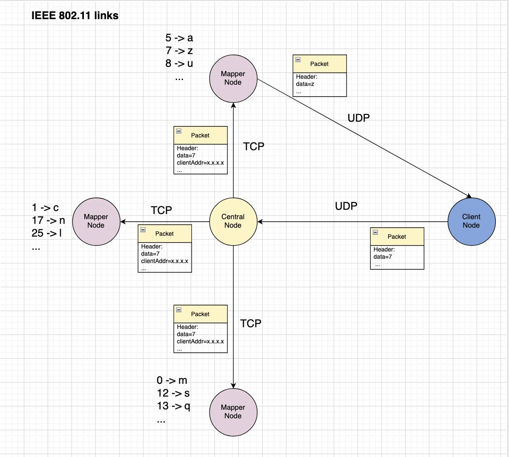

# CN_Chomeworks_2
**Maryam Jafarabadi Ashtiani : 810199549**  
**Sana Sari Navaei : 810199435**

# Project Description  
In this project, we aim to simulate a 4G wireless network using the 3-ns simulation tool and analyze its various parameters. This network implements a simple encryption system.  

The network consists of 3 nodes:
- Client node
- Master node
- Mapper node  

client wants to send a message to the master node usign UDP protocol. The client node encrypts the message using a simple encryption algorithm and sends it to the master node. The master node gets the message and sends it to the mapper nodes using TCP protocol. The mapper nodes decrypt the message and send it to the client node using UDP protocol. At this program, we want to learn how to simulate a network with different encryption algorithms and analyze the network's performance.  

Here's the picture of the network we want to simulate and analyze:  


# Code Description  
The code is written in C++. We are going to explain the code step by step.

## 1. Including the necessary libraries
At the beginning of the code, we include the necessary libraries. Most of the libraries are included in the ns3 library. There are other libraries such as `map` and `vector` that are used to store the data in the code.  
```c++
#include <cstdlib>
#include<time.h>
#include <stdio.h>
#include <string>
#include <fstream>

#include "ns3/core-module.h"
#include "ns3/point-to-point-module.h"
#include "ns3/network-module.h"
#include "ns3/applications-module.h"
#include "ns3/mobility-module.h"
#include "ns3/csma-module.h"
#include "ns3/internet-module.h"
#include "ns3/yans-wifi-helper.h"
#include "ns3/ssid.h"
#include "ns3/core-module.h"
#include "ns3/internet-module.h"
#include "ns3/applications-module.h"
#include "ns3/network-module.h"
#include "ns3/packet-sink.h"
#include "ns3/error-model.h"
#include "ns3/udp-header.h"
#include "ns3/enum.h"
#include "ns3/event-id.h"
#include "ns3/flow-monitor-helper.h"
#include "ns3/ipv4-global-routing-helper.h"
#include "ns3/traffic-control-module.h"
#include "ns3/flow-monitor-module.h"

#include <map>
#include <vector>
```

## 2. Defining the necessary variables
In this part, at first we use the `using namespace` command to use the ns3 and std libraries. Then we define `mapping variables` for the encryption algorithm. The encryption algorithm is a simple algorithm that maps each number to a character. There are 3 mappers in the network. Each mapper has its own mapping.  

```c++
using namespace ns3;
using namespace std;
std::map<int, char> mapper1_mapping = {{0, 'a'},{1, 'b'},{2, 'c'},{3, 'd'},{4, 'e'},{5, 'f'},{6, 'g'},{7, 'h'},{8, 'i'}};
std::map<int, char> mapper2_mapping = {{9, 'j'},{10, 'k'},{11, 'l'},{12, 'm'},{13, 'n'},{14, 'o'},{15, 'p'},{16, 'q'},{17, 'r'}};
std::map<int, char> mapper3_mapping = {{18, 's'},{19, 't'},{20, 'u'},{21, 'v'},{22, 'w'},{23, 'x'},{24, 'y'},{25, 'z'},{26, ' '}};
```
## 3. Header Class
Header class is used to define the header of the packets. The header of the packets contains the data that is sent to the master node. The header of the packets also contains the IP address and the port number of the client node. The header class is defined as follows:  

```c++
class MyHeader : public Header 
{
public:
    MyHeader ();
    virtual ~MyHeader ();
    void SetData (uint16_t data);
    uint16_t GetData (void) const;
    static TypeId GetTypeId (void);
    virtual TypeId GetInstanceTypeId (void) const;
    virtual void Print (std::ostream &os) const;
    virtual void Serialize (Buffer::Iterator start) const;
    virtual uint32_t Deserialize (Buffer::Iterator start);
    virtual uint32_t GetSerializedSize (void) const;
    void SetIp (Ipv4Address ip);
    void SetPort (uint16_t port);
    Ipv4Address GetIp (void) const;
    uint16_t GetPort (void) const;
    
private:
    uint16_t m_data;
    Ipv4Address m_ip;
    uint16_t m_port;
};
```
#### **Now we are going to explain the functions of the header class.**  
Functin `GetTypeId` is used to return a unique identifier (or TypeId) for the MyHeader class. This function is a common pattern used in ns-3 to get the unique TypeId for a class, which is useful for various purposes such as creating objects dynamically, registering callbacks, and more.  

Function `GetInstanceTypeId` is used to return the TypeId of the instance of the MyHeader class. This function is a simple and useful way to get the TypeId of a specific instance of the MyHeader class.  

Function `Print` is used to print the data of the header.  

```c++
TypeId
MyHeader::GetTypeId (void)
{
    static TypeId tid = TypeId ("ns3::MyHeader")
        .SetParent<Header> ()
        .AddConstructor<MyHeader> ()
    ;
    return tid;
}

TypeId
MyHeader::GetInstanceTypeId (void) const
{
    return GetTypeId ();
}

void
MyHeader::Print (std::ostream &os) const
{
    os << "data = " << m_data << endl;
}
```

Function `GetSerializedSize` is used to return the size of the header which is 8 bytes.  

The `Serialize` function takes a **Buffer::Iterator** as an argument and serializes the contents of the MyHeader object to the buffer starting from the given iterator position. The function first converts the **m_data** member variable to network byte order using the **WriteHtonU16** function, then writes the **m_ip** member variable using the **WriteHtonU32** function, and finally writes the **m_port** member variable using the **WriteHtonU16** function.  

The `Deserialize` function takes a **Buffer::Iterator** as an argument and deserializes the contents of the MyHeader object from the buffer starting from the given iterator position. The function first reads the **m_data** member variable using the **ReadNtohU16** function, then reads the **m_ip** member variable using the **ReadNtohU32** function, and finally reads the **m_port** member variable using the **ReadNtohU16** function. The function returns the size of the deserialized data, which is again a fixed value of 8 bytes.  

```c++
uint32_t
MyHeader::GetSerializedSize (void) const
{
    return 8;
}

void
MyHeader::Serialize (Buffer::Iterator start) const
{
    start.WriteHtonU16 (m_data);
    start.WriteHtonU32(m_ip.Get());
    start.WriteHtonU16(m_port);
}

uint32_t
MyHeader::Deserialize (Buffer::Iterator start)
{
    m_data = start.ReadNtohU16 ();
    m_ip.Set(start.ReadNtohU32());
    m_port = start.ReadNtohU16();
    return 8;
}
```

Function `SetData` takes a **uint16_t** value as an argument and sets the **m_data** member variable to that value.  

Function `GetData` returns the value of the **m_data** member variable.  

Function `SetIp` takes an **Ipv4Address** value as an argument and sets the **m_ip** member variable to that value.  

Function `SetPort` takes a **uint16_t** value as an argument and sets the **m_port** member variable to that value.  

Function `GetIp` returns the value of the **m_ip** member variable.  

Function `GetPort` returns the value of the **m_port** member variable.  

```c++
void
MyHeader::SetData (uint16_t data)
{
    m_data = data;
}

uint16_t
MyHeader::GetData (void) const
{
    return m_data;
}

void
MyHeader::SetIp (Ipv4Address ip)
{
    m_ip = ip;
}

void
MyHeader::SetPort (uint16_t port)
{
    m_port = port;
}

Ipv4Address
MyHeader::GetIp (void) const
{
    return m_ip;
}

uint16_t
MyHeader::GetPort (void) const
{
    return m_port;
}
```
## 4. Client Class

Client class is used to define the client node. The client node sends the data to the master node. It also receives the result from the master node. The **std::vector<uint16_t> input** stores data that will be sent to the master node. We choose the word `computer-network` as the data to be sent. The client class is defined as follows:  

```c++
class client : public Application
{
public:
    client (uint16_t port, Ipv4InterfaceContainer& ip, uint16_t master_port, Ipv4InterfaceContainer& master_ip);
    virtual ~client ();

private:
    virtual void StartApplication (void);
    void HandleRead (Ptr<Socket> socket);

    uint16_t port;
    Ipv4InterfaceContainer ip;
    uint16_t master_port;
    Ipv4InterfaceContainer master_ip;
    std::string result = "";
    std::vector<uint16_t> input = {2,14,12,15,20,19,4,17,27,13,4,19,22,14,17,10,26};
    uint16_t indx = 0;
};
```

